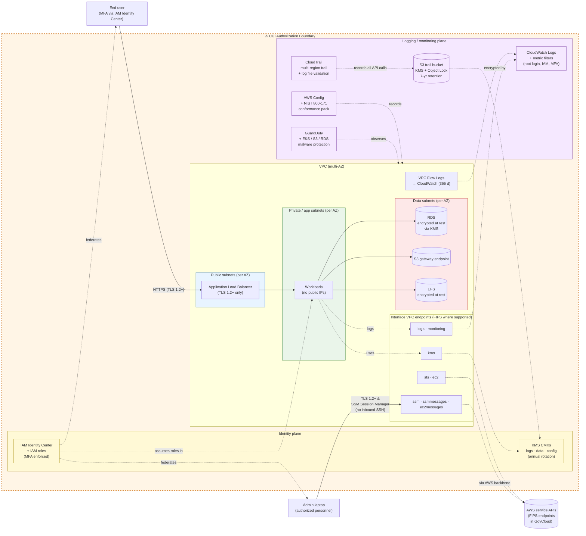
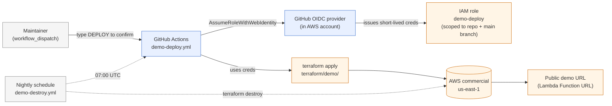

# Network architecture

Two diagrams: the **CUI enclave network** (the architecture this repo
realizes) and the **demo deploy pipeline** (how the commercial-AWS demo
gets stood up).

> Same diagram, different deploy. The GovCloud root (`terraform/govcloud/`)
> and the commercial demo root (`terraform/demo/`) instantiate the same
> module shapes; only the partition, region, FIPS endpoint flags, and a
> handful of cost-control variables differ.

## CUI enclave network

### What crosses the boundary

| Direction | Traffic | Mechanism |
|---|---|---|
| Admin → enclave | Privileged shell access | **AWS SSM Session Manager only** (no bastion, no inbound SSH); admin laptops authenticate via IAM Identity Center with MFA |
| User → enclave | Application traffic | HTTPS (TLS 1.2+) to ALB; user identity federated via IAM Identity Center / Cognito with MFA |
| Enclave → AWS APIs | Service control plane | Interface / Gateway VPC endpoints (FIPS endpoints in GovCloud); no NAT, no internet egress required for AWS service traffic |
| Enclave → external SaaS | (intentionally restricted) | Out-of-scope for this reference; consumer wires explicit egress through a managed proxy if required |

### What this diagram does NOT show

- **Workload modules** — the green "Workloads" box is a placeholder; consumers attach their own ECS / EKS / EC2 / Lambda definitions
- **Org-trail / log archive account** — for multi-account deployments the CloudTrail bucket lives in a separate logging account; this diagram assumes single-account for clarity
- **SIEM forwarding** — CloudWatch Logs subscription filters → external SIEM are a consumer concern
- **DR / cross-region replication** — single-region for diagram clarity; real CUI deployments often add cross-region S3 replication for the trail bucket

## Demo deploy pipeline

The demo deploy pipeline uses **GitHub Actions OIDC** federation — there
are no long-lived AWS access keys in the repo or in CI. Both `deploy` and
`destroy` workflows require a typed-confirmation input (`DEPLOY` /
`DESTROY`); destroy also runs nightly on a schedule to bound cost. Full
operator guide: [`docs/demo-deploy.md`](../docs/demo-deploy.md) (added in
prompt 09).
